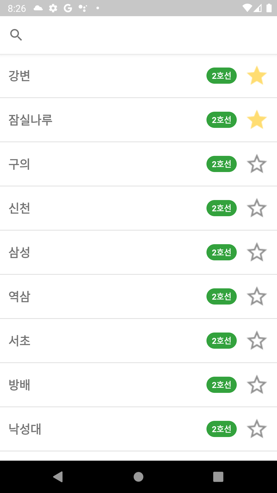
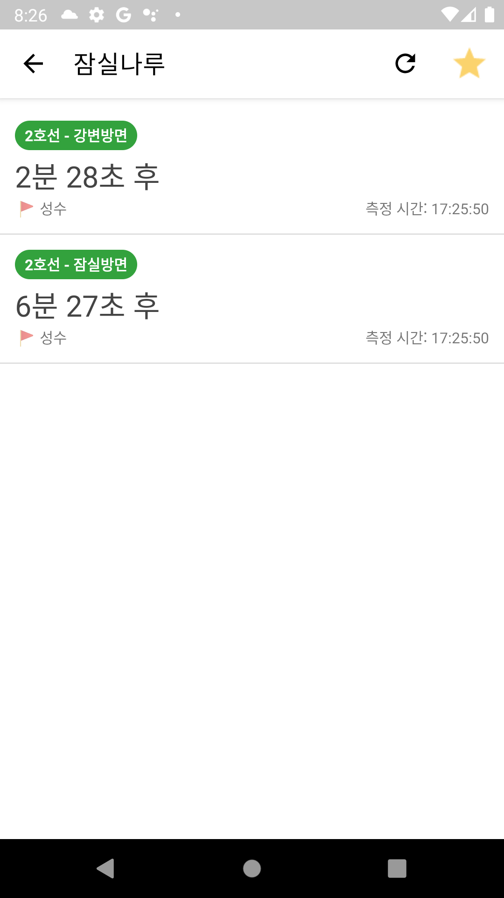

# Android Clone Coding Project #27 Subway
서울 지하철 역 목록 확인 가능
 
서울 지하철 상세 정보(도착시간) 확인가능
 
서울 지하철 역 검색 가능
 
즐겨찾기 가능
 

# 결과화면
|Screenshot1|Screenshot2|
|---|---|
|||

 

# 배운 내용 정리
- MVP
- Jetpack Navigation
- Firebase Cloud Storage
- Koin
- Room
- 서울 열린 데이터 광장 API
